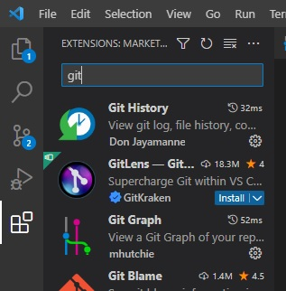
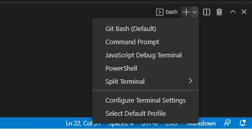

## git導入
- githubアカウント作成
    - https://github.com/
    - とりあえず今のところは佐竹が作成したこのリポジトリにソースコードと資料を置くことにしているので, アカウントができたらユーザ名を佐竹に教えてください
- git for windowsインストール (macは知らん
    - 参考 https://www.curict.com/item/60/60bfe0e.html
    - ターミナルで以下を実行
        - $ git config --global user.name ユーザ名
        - $ git config --global user.email メールアドレス
- vscode拡張機能インストール
    - vscodeの拡張機能検索から, git graphとgit historyをインストール

- 必要な準備は以上です

## 無駄情報
- git for windowsをインストールするとgit bashというものがおまけでついてきます. bashはlinux OSでよく使われるシェルで, windowsでいうpowershell的なやつです. vscodeのデフォルトのシェルをbashにすることで, linuxで使われるコマンドを使えるようになります. linuxはオープンソースということもあってかそれなりにいろんなところで使われているので, 少しでも慣れておくと後々役に立つ...かもしれません.
- 変更方法
    - vscodeでターミナルを開く
    - 右上の+マークの隣の下向き三角マークから, select Default profileを選択

    - default terminalにgit bashを選択
    - 次から起動するターミナルがbashになります. シェル名(画像ではbashってなってるところ)をクリックすると直接変更できます. 