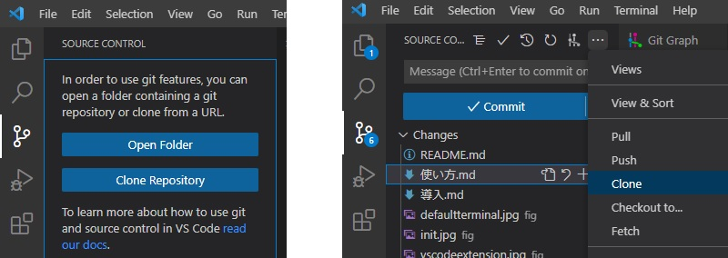
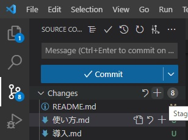
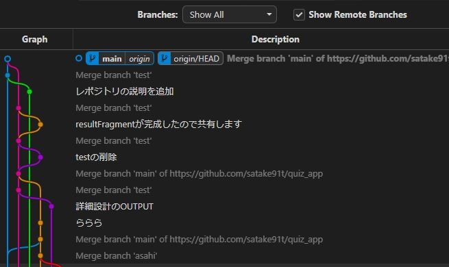

## 用語
- レポジトリ
    - ディレクトリとかフォルダと多分同じ
- ブランチ
    - 分岐 (直訳)
    - レポジトリに変更を加えるときは直接ではなく, まず分岐を作ってからそこで編集し, 後からその変更をmainに反映させる
- チェックアウト
    - 現在いるブランチから選択したブランチへ移動すること
- クローン
    - リモートのレポジトリをローカルpcにコピーすること
- ステージング & コミット
    - 変更をブランチに反映させること
    - 2段階あるのは意味があるんだろうけど知らない
- マージ
    - ブランチをほかのブランチ(主にmain)に統合すること
- プッシュ
    - ローカルでの変更をリモートに反映させうこと
    - これをすることで, ブラウザ上で見ても変更された状態になる
- プル
    - 現在のリモートレポジトリの状態をローカルに反映させること
    - 前回のプル~プッシュの間に他の人が変更を加えた場合, これをしないとプッシュができないらしい

## 利用手順 (GUI)
- 変更をリモートに反映させるためにはプッシュ権限が必要なのでアカウント名を佐竹に教えてください(クローンとかはできるはず)
- クローン
    - Clone Repositryをクリック
    - Clone Repositryがなければ上のほうの丸3つボタンからCloneを選択
    - 入力欄に https://github.com/satake91t/quiz_app を入力, 適当な場所にリポジトリをコピーする

- ブランチ作成
    - 左下の"Git Graph"を押してGit Graphを開く.
    - main|originの左の〇を右クリックしてcreate branchを選択, 適当に名前をつける
        - 左下に今いるブランチの名前が表示される
- 編集
    - ローカルのリポジトリを編集する
        - 空のディレクトリのみを追加することは不可
- ステージング & コミット
    - 変更したファイルが左に表示されるので, +ボタンを押してステージング
        - 複数のファイルがある場合, changesの横の+を押すと一括操作可能
        - 完了すると, Staged Changesとして表示される
    - どんな変更をしたかをMessageに入力し, Commitを押す
        - Messageがないとエラー出るかも

- マージ
    - git graphのmain|originを右クリックしチェックアウト
    - 作成したブランチを右クリック, Merge into current Branchを選択
        - 現在のブランチ(main)にマージされる
- プッシュ
    - 左にSync~みたいなのが出てたらそれ押せばプルとプッシュ一緒にやってくれるっぽい
    - ~~上のほうの丸3つボタンからPushを選択~~
        - 変更がリモートに反映される
        - ~~他の人が編集してた場合「最新の状態にしてからプッシュしろ」と言われることがあるので, 丸3つボタンからPullしてからやったほうがよさそう~~
- これで完了. こんな感じになる↓

- その他
    - プッシュが完了したら作成したブランチはもう不要なので右クリックから削除しておく
        - mainとかoriginは消さないように注意
    - クローンしたレポジトリを残しておけば, 2回目以降はクローン不要
        - 現在のリポジトリをPull, ブランチの作成~Push